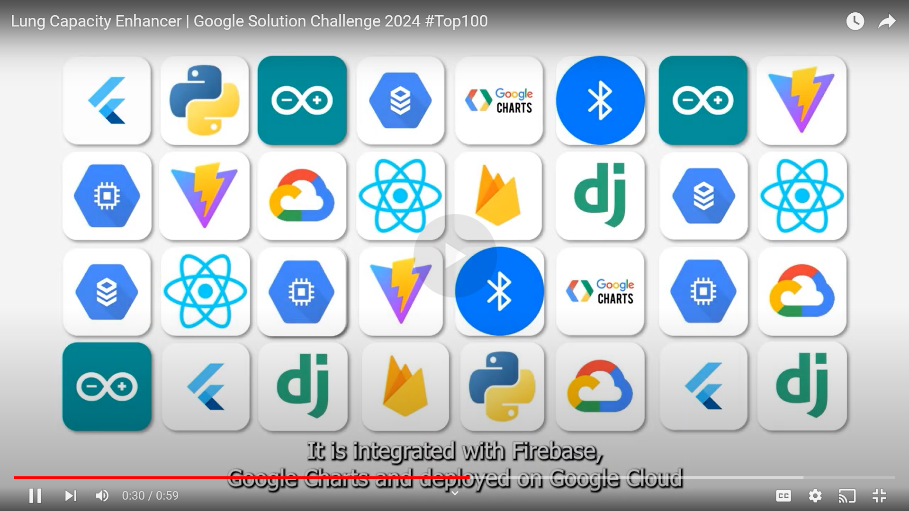
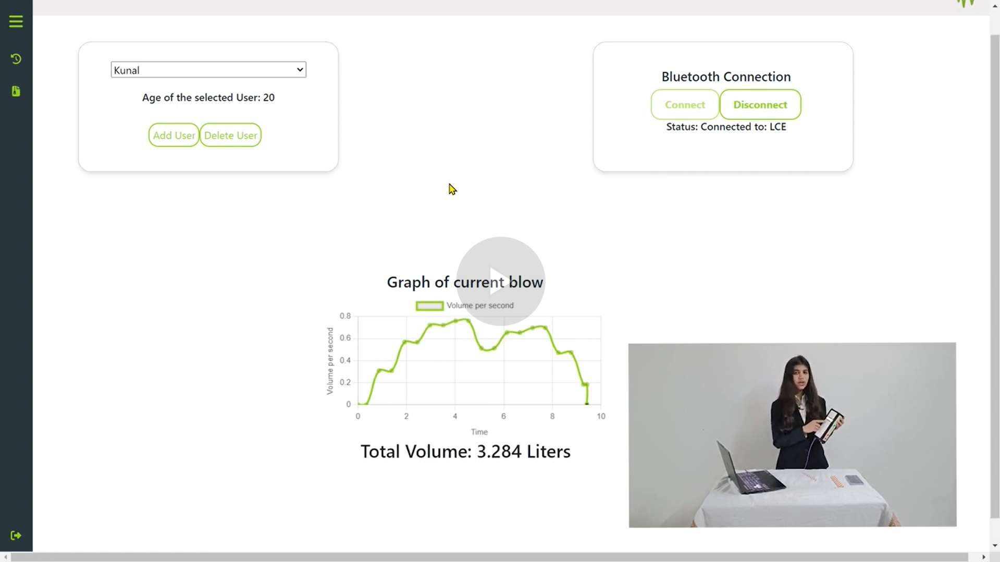
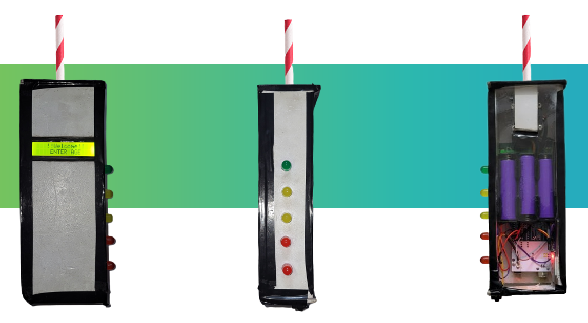
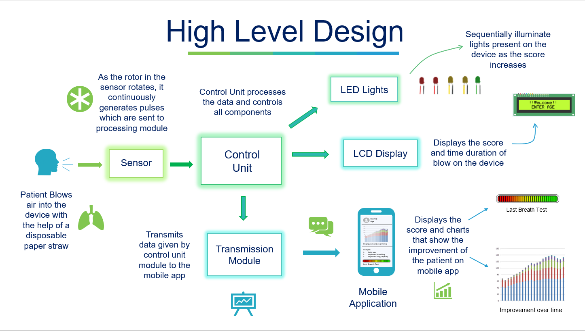
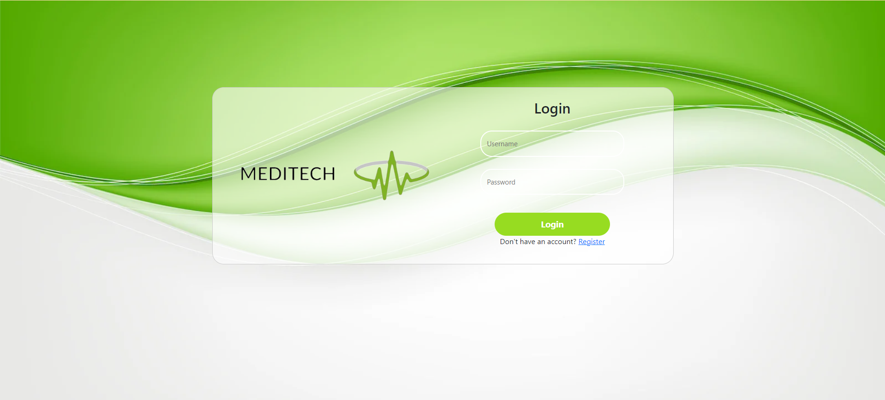
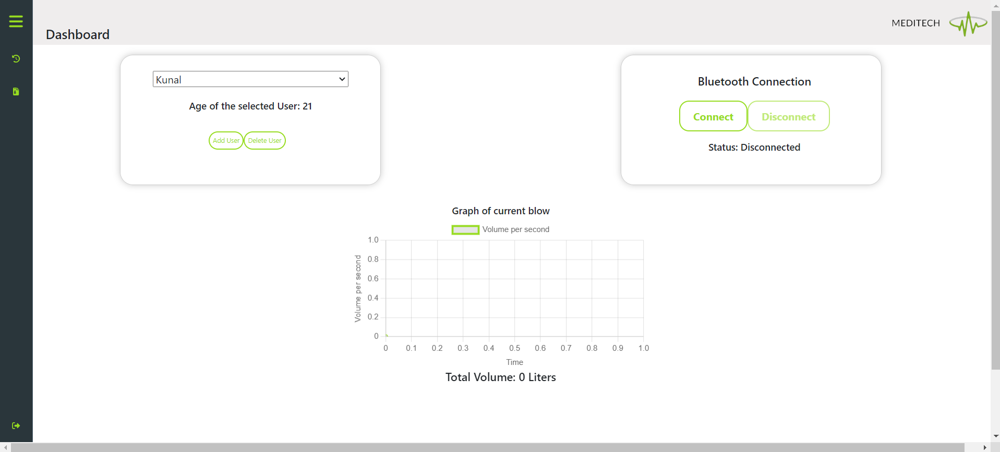
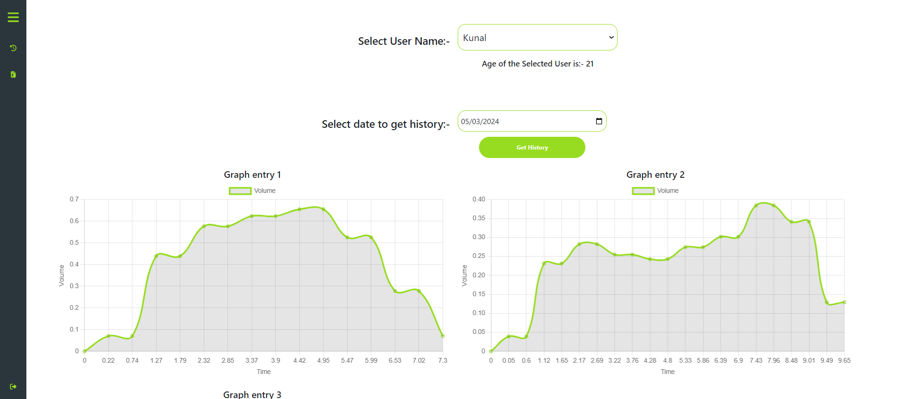
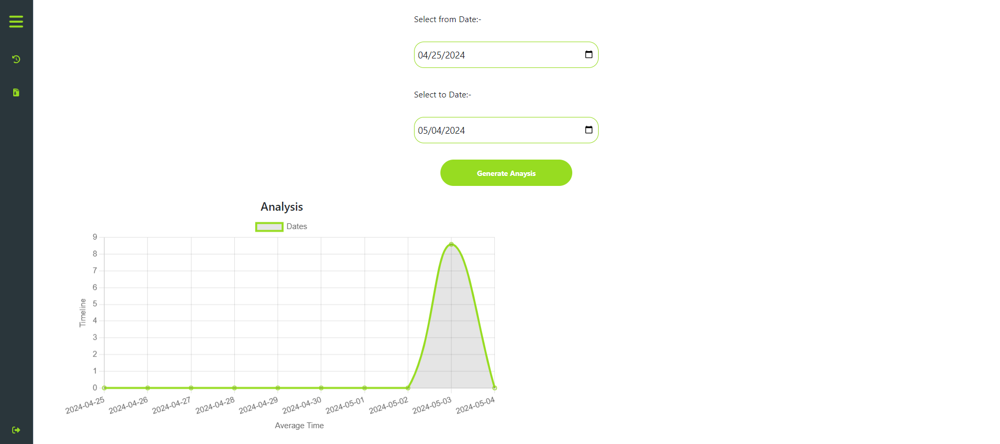

# Lung Capacity Enhancer

## Watch the GDSC challenge Global top 100 video!

## Watch the GDSC challenge video!

  
***This project consists of an Flutter Application code, Arduino code and a web application with separate frontend and backend for the Lung Capacity Enhancer device along with the android APK and the URL provided to the deployed website.***
## Table of Contents
- [Problem Statement](#problem-statement)
- [About Device](#about-device)
- [Deployed Website URL](#deployed-website-url)
- [Download APK](#download-apk)
- [Arduino Code (Lung_Capacity_Enhancer)](#arduino-code-lung_capacity_enhancer)
- [Installation](#installation)
- [Web Application (Website)](#web-application-website)
  - [Frontend](#frontend)
  - [Backend](#backend)
- [Usage](#usage)
  - [Lung Capacity Enhancer Device](#lung-capacity-enhancer-device)

## Problem Statement
In India, pediatric respiratory care poses significant challenges, encompassing healthcare, emotional well-being, and practical considerations, and these challenges have intensified further following the COVID-19 pandemic. Traditional methods lack sufficient user engagement, often resulting in non-compliance among young patients facing respiratory challenges. The current landscape also faces issues of cost-effectiveness, hindering widespread access to effective treatment. Hygiene concerns in healthcare settings further amplify the need for innovative solutions that prioritize cleanliness and portability. Emotional support for pediatric patients during respiratory treatments is often overlooked. Considering these multifaceted challenges, there is a pressing need for a comprehensive and user-centric solution that not only addresses clinical efficacy but also factors in cost-effectiveness, hygiene standards, and emotional well-being. A portable device that combines sensor technology, gamification for enhanced user engagement, cost-effective components, and a focus on hygiene would significantly contribute to overcoming the existing barriers in pediatric respiratory care in India.

## About Device
A standalone device with dedicated software designed as an interactive game for children and adults to enhance their lung capacity, especially those suffering from respiratory issues.

## Deployed Website URL

[Access Lung Capacity Enhancer Website](https://lcefrontend.as.r.appspot.com/)

## Download APK
You can download the APK for the Lung Capacity Enhancer Android app from the [repository](https://github.com/Kunal-Wagh282/Lung_Capacity_Enhancer-GDSC-Repo-/blob/main/LCE_Flutter_app.apk).

## Arduino Code (Lung_Capacity_Enhancer)
This folder contains the Arduino code for the Lung Capacity Enhancer device.

## Installation
1. Clone the repository:
   
       git clone https://github.com/Kunal-Wagh282/Lung_Capacity_Enhancer-GDSC-Repo-
2. Navigate to the Website directory:
   
       cd Website

## Web Application (Website)
The web application consists of two parts: frontend and backend.

## Frontend
This folder contains the frontend code for the Lung Capacity Enhancer web application.
### Frontend Features

#### Registration Page
- **User Registration**: Users can register with their username, first name, last name, date of birth, and password. The minimum age requirement for registration is 5 years old.
  

#### Login Page
- **User Login**: Registered users can log in with their username and password, and retrieve their profile information.
  

#### Dashboard
- **Profile Management**: Users can add, delete, and view their profiles. Each profile has a name and date of birth.
- **Bluetooth Connection**: Users can establish a Bluetooth connection with the device.
- **Real-time Graph**: Users can view real-time graph data while blowing into the device.
  

#### History Page
- **View Past Data**: Users can view past history data in the form of graphs.
  

#### Analysis Page
- **Generate Analysis**: Users can select a range of dates and view analysis reports.
 

### Prerequisites
- Node.js installed on your computer
- Vite installed on your computer

### Installation
1. Navigate to the `frontend` directory:
   
       cd frontend

2. Install dependencies:

       npm install

### Frontent Usage
   To run the development server, use the following command:

    npm run dev

## Backend
This folder contains the backend code for the Lung Capacity Enhancer web application.
This is a Django-based backend API that provides various functionalities such as user registration, login, profile management, graph data storage and retrieval, and report generation.

### Backend Features

- **User Registration**: Users can register with their username, first name, last name, date of birth, and password. The minimum age requirement for registration is 5 years old.
- **User Login**: Registered users can log in with their username and password, and retrieve their profile information.
- **Profile Management**: Users can add, delete, and view their profiles. Each profile has a name and date of birth.
- **Graph Data Storage**: Users can save graph data, including time and volume arrays, for their profiles. The total volume (area under the curve) is calculated and stored.
- **Graph Data Retrieval**: Users can retrieve their graph data for a specific date and profile.
- **Report Generation**: Users can generate reports containing their graph data within a specified date range for a particular profile.

### Installation
   
1. Navigate to the project directory:
   
       cd backend
   

2. Create a virtual environment (optional but recommended):
   
       python -m venv env
       source env/bin/activate  # On Windows, use `env\Scripts\activate`
   

3. Install the required dependencies:
   
       pip install -r requirements.txt
   

4. Set up the Django project:
   
       python manage.py migrate
   

### Backend Usage

1. Start the Django development server:
   
       python manage.py runserver
   

2. The API endpoints can be accessed at `http://localhost:8000/api/`. You can use tools like Postman or cURL to interact with the API.

3. Refer to the `api/urls.py` file for the available endpoints and their corresponding views in `api/views.py`.

### API Endpoints

- `POST /api/register/`: Register a new user.
- `POST /api/login/`: Log in an existing user.
- `POST /api/add-profile/`: Add a new profile for a user.
- `POST /api/del-profile/`: Delete a profile for a user.
- `POST /api/graph-data/`: Save graph data for a user's profile.
- `POST /api/get-graph-data/`: Retrieve graph data for a user's profile on a specific date.
- `POST /api/generate-analysis/`: Generate a analysis graph for a user's profile within a specified date range.

## Usage

### Lung Capacity Enhancer Device

1. **Setup Device**
   - Turn on the device using the power button.

2. **Connect Device to Web or Mobile Application**
   - Open the web application on your computer or mobile device.
   - Go to the Dashboard.
   - Click on the "Bluetooth Connection" button to establish a Bluetooth connection with the device.

3. **Start Lung Capacity Enhancement**
   - Instruct the user to blow into the device as hard as possible for the duration of the game.
   - The user's lung capacity will be measured and displayed in real-time on the web/mobile application.

4. **View History and Analysis**
   - Users can view past history data
  
### Example Login

To log in and test the features of the Lung Capacity Enhancer web application, follow these steps:

1. Open the web application on your computer or mobile device.
2. Navigate to the Login page.
3. Enter the following credentials:
   - **Username:** `Kunal`
   - **Password:** `12345`
4. Click on the "Login" button to log in.

After logging in, you can explore the various features of the application using the provided example profile and dates:

- **Profile:** `kunal`
- **Dates:** May 3, 2024, and May 4, 2024

Feel free to try out the registration, profile management, viewing past data, and generating analysis reports using the provided credentials and dates.

